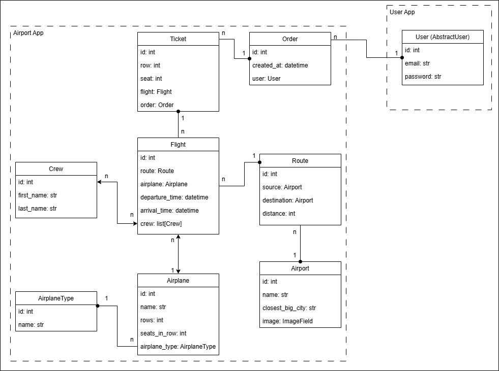

# ✈️ Airport API Service

This project is a **REST API service** for managing airports, airplanes, airplane types, routes, crew, flights, order and tickets.
It is built using **Django Rest Framework (DRF)** with **PostgreSQL** and **Docker**.

## 🛠 Installation

### `Python3` & `Docker` must be already installed

```shell
git clone https://github.com/mykytafabrykator/airport-api-service.git
cd airport-api-service
python3 -m venv venv
source venv/bin/activate # (on macOS)
venv/Scripts/activate # (on Windows)
pip install -r requirements.txt
```

Create a `.env` file in the root directory of the project and copy the contents from `.env.sample`, replacing the placeholder values with your own:

```shell
cp .env.sample .env
```

## 🚀 Running the Project

### Using Docker (Recommended)

```shell
docker-compose build
docker-compose up
```

### Running without Docker
```shell
python manage.py migrate
python manage.py runserver
```

### Loading Test Data (Optional)

```shell
docker-compose exec app python manage.py loaddata load_data.json
```

## 👤 Test Credentials

### Admin User
* login: admin@admin.com
* password: password

### Regular User
* login: admin@admin.ua
* password: hello

## 📄 API Documentation
After running the project, the API documentation will be available at:
* Swagger UI: http://localhost:8001/api/v1/doc/swagger/
* ReDoc: http://localhost:8001/api/v1/doc/redoc/

## ✨ Features
- User authentication & authorization (JWT)
- Permissions are role-based (Admin, Authenticated User, Unauthenticated User).
- Admin panel /admin/
- Manage airports, including image uploads.
- Manage airplanes and airplane types.
- Search and filter flights by source, destination, and dates.
- Retrieve flight details, including available and occupied seats.
- Pagination for order history (10 per page).
- API documentation with Swagger & ReDoc
- Database persistence using PostgreSQL
- Docker support for easy deployment

## ✍️ Tech Stack
- Python 3.12
- Django & Django REST Framework
- SQLite3 (for development)
- PostgreSQL (for production)
- Docker & Docker Compose
- JWT Authentication (Simple JWT)
- Swagger Documentation (drf-spectacular)
- Testing (unittest, DRF TestCase)

## 📁 Database Structure

